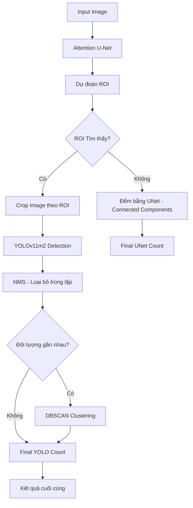
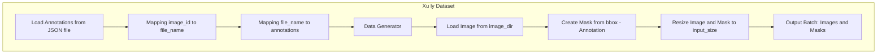
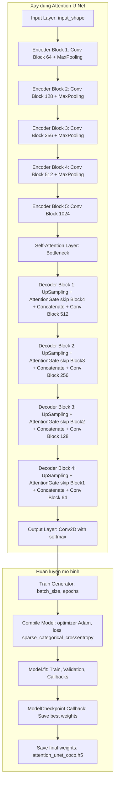

# 🏗 **Topology của Hệ thống Phát hiện và Đếm Đối tượng**  

##### Link model training
[Model yolo after 700 epochs and enhance image](https://drive.google.com/file/d/1zwTjVbIii7afvw-E-_x_N18gXeMUzjfq/view?usp=drive_link)

[Attention Unet5](https://drive.google.com/file/d/1Sg7u8kZa7zPE3XgtB3xg-Ed3MitKNlBr/view?usp=drive_link)

[Những hình ảnh đầu ra cảu quá trình test](https://drive.google.com/drive/folders/1cb-z6BdstMr9oSzAnVAikZuJ4JVnyvZ9?usp=drive_link)

## 📁 **1. Thành phần chính**  
- **Input**: Ảnh từ các thư mục theo loại đối tượng (type folder).  
- **Models**:  
  - **YOLOv11m2**: Phát hiện đối tượng trong ảnh.  
  - **Attention U-Net**: Xác định vùng quan tâm (ROI) chứa đối tượng.  
- **Clustering**: Sử dụng **DBSCAN** để xử lý tình huống có nhiều đối tượng gần nhau.  

---

## ⚙️ **2. Quy trình hoạt động**  

## 🛠 **3. Các hàm chính**

### `pipeline_inference_with_unet_roi(image_path)`
- Chạy **U-Net** để dự đoán vùng chứa vật thể.  
- Chạy **YOLO** trên vùng **ROI** hoặc dùng kết quả **U-Net** nếu **YOLO** không phát hiện.  

### `apply_nms(boxes, iou_threshold)`
- Áp dụng **Non-Max Suppression (NMS)** để loại bỏ các **bbox** trùng lặp.  

### `adjust_for_crowded(predicted_boxes)`
- Dùng thuật toán **DBSCAN** gom nhóm các đối tượng gần nhau.  

### `load_ground_truth_count(label_path, expected_class)`
- Đếm số lượng **ground truth** trong tệp nhãn.  

### `evaluate_yolo_on_type_folder(base_folder)`
- Chạy đánh giá trên từng thư mục theo loại đối tượng.  

---

## 🏷 **4. Kết quả Đầu ra**  

- **YOLO Count**: Số lượng đếm được từ **YOLO**.  
- **UNet Count**: Số lượng đếm được từ **U-Net**.  
- **Final Count**: Kết quả cuối cùng (ưu tiên YOLO nếu có).  
- **ROI BBox**: Vùng bao của **ROI** trong ảnh gốc.  

---

## 📊 **5. Công nghệ và Thư viện**  

- **YOLOv11m2**: Mô hình phát hiện đối tượng.  
- **Attention U-Net**: Phân đoạn ảnh và xác định vùng chứa đối tượng.  
- **DBSCAN (Sklearn)**: Gom nhóm đối tượng.  
- **OpenCV**: Xử lý ảnh.  
- **Numpy, Torch**: Xử lý số liệu và tensor.

## 🏗 Topology cho mô hình Attention U-Net và quy trình huấn luyện
Huấn luyện mô hình Attention U-Net với Self-Attention cho bài toán phân đoạn ảnh (Image Segmentation)

